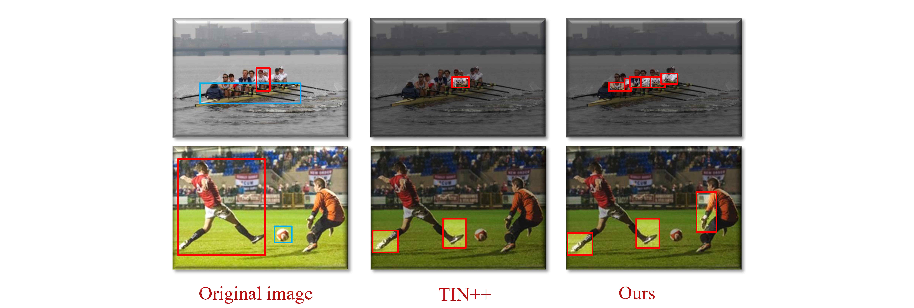

# Body-Part Map for Interactiveness
This repo contains the official implementation of our paper:

**Mining Cross-Person Cues for Body-Part Interactiveness Learning in HOI Detection (ECCV 2022)**

Xiaoqian Wu*, Yong-Lu Li*, Xinpeng Liu, Junyi Zhang, Yuzhe Wu, and Cewu Lu
[[Paper]()] [[Supplementary Material]()] [[arXiv](https://arxiv.org/pdf/2207.14192v1.pdf)] 
(links upcoming)

In this paper, we focus on learning human body-part interactiveness from a previously overlooked *global* perspective. We construct **body-part saliency maps** to mine informative cues from not only the targeted person, but also *other persons* in the image.



## Dependencies
```
python==3.9
pytorch==1.9
torchvision==0.10.1
```
## Data preparation
For HICO-DET, download the pre-calculated pose keypoint files [here](https://drive.google.com/drive/folders/16fYJ5trvMzA6ZjHIJVHcPkgTLbiZSMtl?usp=sharing), and put them into `data` folder. They are used for body-part saliency map calculation.

HICO-DET dataset can be downloaded [here](https://drive.google.com/file/d/1QZcJmGVlF9f4h-XLWe9Gkmnmj2z1gSnk/view). After finishing downloading, unpack `hico_20160224_det.tar.gz` into `data` folder. We use the annotation files provided by the PPDM authors. The annotation files can be downloaded from [here](https://drive.google.com/drive/folders/1WI-gsNLS-t0Kh8TVki1wXqc3y2Ow1f2R).

For training, download the COCO pre-trained DETR [here](https://drive.google.com/drive/folders/16fYJ5trvMzA6ZjHIJVHcPkgTLbiZSMtl?usp=sharing) and put it into `params` folder.

## Training
```
python -m torch.distributed.launch --nproc_per_node=4 main.py --config_path configs/interactiveness_train.yml
```
## Evaluation
```
python -m torch.distributed.launch --nproc_per_node=4 main.py --config_path configs/interactiveness_eval.yml
```

## TODO
- [ ] The pretrained model and result file
- [ ] Auxiliary benchmark code

## Citation
Upcoming